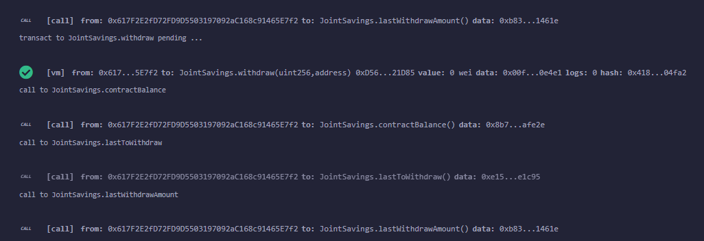

# fintech_challenge_20
This challenge involved creating a solidity application which has the capabilities of setting accounts, deposit, withdrawl, and more.

---
## Use

First, we set the accounts. Dummy account addresses are given.

Next, we will deposit 1, 5, and 10 Eth respectively

Finally, we will withdraw 5 Eth to account one and 10 Eth to account two.

---
## Contributors
Kevin Gross

---
## License
This program is covered under the MIT license.